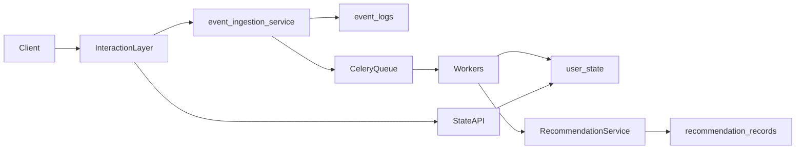

## Phase 0 Backend Implementation Plan

### 1. Project directory structure

- **1.1 Create base Python package layout**
  - Under repo root, create `app/` with subpackages aligned to `AGENTS.md`:
    - `app/api/` – FastAPI routers and request/response schemas wiring.
    - `app/core/` – settings, logging, security, app wiring, utils.
    - `app/db/` – DB session management, base metadata, engine, alembic config helpers.
    - `app/models/` – SQLAlchemy models (start with `user_state`, `event_logs`).
    - `app/schemas/` – Pydantic v2 schemas for API IO and internal structured payloads.
    - `app/services/` – orchestration services (`event_ingestion_service`, `state_update_service`, etc., as interfaces or stubs).
    - `app/workers/` – Celery app and task modules (stubs for parse/enrich/compress/push).
    - `app/ranking/` – placeholder for candidate filter/ranker modules (Phase 0: empty or TODOs).
    - `app/prompts/` – placeholder for prompt templates (Phase 0: skeleton files only).
    - `app/telemetry/` – logging/tracing/metrics helpers (Phase 0: basic logger setup).
  - Add top-level entrypoints:
    - `[app/main.py](app/main.py)` – FastAPI app factory and ASGI entrypoint.
    - `[worker/celery_app.py](worker/celery_app.py)` or `[app/workers/celery_app.py](app/workers/celery_app.py)` – Celery app initialization.
  - Add supporting files:
    - `pyproject.toml` or `requirements.txt` for dependencies.
    - `alembic.ini` and `migrations/` for schema migrations.
    - `tests/` with basic structure for API and models.

### 2. Configuration system

- **2.1 Define settings model**
  - In `[app/core/config.py](app/core/config.py)`, define a Pydantic v2 `BaseSettings`-style config class, e.g. `AppSettings`, with sections:
    - `env` (environment name), `debug` flag.
    - `database_url` (PostgreSQL DSN), `async_database_url` if needed.
    - `redis_url` for cache/idempotency/queues.
    - `celery_broker_url`, `celery_result_backend` (likely Redis/Postgres).
    - `llm_base_url`, `llm_api_key` (placeholders for later phases).
    - `log_level`, `sentry_dsn` (optional for later).
  - Implement environment-based loading with `.env` support and override via env vars.
- **2.2 Wire config into app startup**
  - In `[app/core/deps.py](app/core/deps.py)` or similar, create a singleton accessor for `settings` to be reused in API, DB, and Celery.
  - Ensure FastAPI app instance in `main.py` reads config once and injects via dependency where needed.

### 3. Database setup (PostgreSQL + SQLAlchemy)

- **3.1 Define DB engine and session management**
  - In `[app/db/session.py](app/db/session.py)`, create synchronous/async SQLAlchemy engine factory using `settings.database_url`.
  - Define `SessionLocal` (sync) or async session maker, plus FastAPI dependency for per-request sessions.
  - Expose `Base = declarative_base()` (or SQLAlchemy 2.x `DeclarativeBase`) in `[app/db/base.py](app/db/base.py)`.
- **3.2 Implement core models for fact/snapshot layers**
  - In `[app/models/user_state.py](app/models/user_state.py)`, implement `UserState` model exactly mirroring `user_state` table from `03_Database_Schema_V2.md`, including:
    - `user_id` PK, `state_version`, energy fields, `focus_mode`, `do_not_disturb_until`, `recent_context`, `source_last_event_id`, `source_last_event_at`, timestamps.
  - In `[app/models/event_logs.py](app/models/event_logs.py)`, implement `EventLog` model from the schema spec, including:
    - Fact-layer fields for source, external IDs, payload hash, raw input, parsed impact JSONB, parse/processed status, `occurred_at`, created timestamp, uniqueness constraints.
  - Register models in `[app/db/base.py](app/db/base.py)` so Alembic autogenerate sees them.
- **3.3 Add optional history table**
  - In `[app/models/state_history.py](app/models/state_history.py)`, model the `state_history` table to support future replay/debugging.

### 4. Migration system (Alembic)

- **4.1 Initialize Alembic**
  - Create `[alembic.ini](alembic.ini)` pointing to the `migrations/` directory.
  - Under `[migrations/env.py](migrations/env.py)`, configure Alembic with SQLAlchemy 2.x pattern:
    - Import `settings.database_url`.
    - Import `Base` and metadata from `app/db/base.py`.
- **4.2 Create initial revision for core tables**
  - Generate first migration containing `user_state`, `event_logs`, and `state_history` tables aligned exactly with `03_Database_Schema_V2.md`.
  - Ensure constraints and indexes from the spec are represented (PKs, uniques, and key indexes for common queries).
- **4.3 Define migration run path**
  - Add a small CLI helper or makefile/script doc to run:
    - `alembic upgrade head` for local dev.
  - Document in `README.md` how to configure DB URL and run migrations.

### 5. Base FastAPI app

- **5.1 App factory and lifecycle hooks**
  - In `[app/main.py](app/main.py)`, implement:
    - `create_app()` that:
      - Loads `settings`.
      - Configures logging.
      - Initializes DB and Redis connections if needed.
      - Includes API routers from `app/api/`.
    - `app = create_app()` for ASGI servers.
  - Add startup/shutdown events to test DB connectivity and log environment.
- **5.2 API routers and versioned prefix**
  - Under `app/api/`, define router modules:
    - `[app/api/routes_state.py](app/api/routes_state.py)` – `GET /api/v1/state`, `POST /api/v1/state/reset` skeletons.
    - `[app/api/routes_chat.py](app/api/routes_chat.py)` – `POST /api/v1/chat/messages` skeleton.
    - `[app/api/routes_webhooks.py](app/api/routes_webhooks.py)` – `POST /api/v1/webhooks/{source}` skeleton.
    - `[app/api/routes_recommendations.py](app/api/routes_recommendations.py)` – `GET /api/v1/recommendations/pull`, `GET /api/v1/recommendations/brief`, `POST /api/v1/recommendations/{id}/feedback` skeletons.
  - Define a base router in `[app/api/router.py](app/api/router.py)` to mount all sub-routers under `/api/v1` and include in `main.py`.
- **5.3 Schema stubs for requests/responses**
  - In `app/schemas/`, define Pydantic models that match the shapes in `02_API_Workflows_Prompts_V2.md`, but with minimal validation logic for now.
  - Use these schemas in router signatures so Phase 0 already locks in the API shapes.

### 6. Worker architecture (Redis + Celery)

- **6.1 Celery app initialization**
  - In `[app/workers/celery_app.py](app/workers/celery_app.py)`, define a `Celery` instance configured with:
    - Broker = `settings.celery_broker_url` (Redis).
    - Result backend = `settings.celery_result_backend`.
    - Common config (task serialization JSON, time limits, acks_late if desired).
  - Ensure Celery tasks can import `settings`, DB sessions, and models.
- **6.2 Core task stubs matching architecture**
  - Create task modules with empty or logging-only tasks for now:
    - `[app/workers/tasks_parse.py](app/workers/tasks_parse.py)` – `parse_event_log` aligning to Data Agent flow.
    - `[app/workers/tasks_state.py](app/workers/tasks_state.py)` – `apply_state_patch` or similar.
    - `[app/workers/tasks_enrich.py](app/workers/tasks_enrich.py)` – `enrich_active_nodes`.
    - `[app/workers/tasks_compress.py](app/workers/tasks_compress.py)` – `compress_event_logs`.
    - `[app/workers/tasks_push_eval.py](app/workers/tasks_push_eval.py)` – `evaluate_push_opportunities`.
  - Wire tasks but keep implementations minimal (just log inputs) in Phase 0 so pipelines can be invoked safely in later phases.
- **6.3 Event flow integration points**
  - In service stubs (e.g. `event_ingestion_service`), add calls that enqueue Celery tasks:
    - Chat or webhook ingest: create `event_logs` record, then queue `parse_event_log`.
    - Later phases will fill in parsing/state update logic without changing the queue topology.

### 7. API route skeletons and service boundaries

- **7.1 Service modules**
  - Under `app/services/`, create skeleton services:
    - `[app/services/event_ingestion.py](app/services/event_ingestion.py)` – create `event_logs` rows and trigger Celery tasks.
    - `[app/services/state_service.py](app/services/state_service.py)` – load/write `user_state` with CAS semantics (interface only in Phase 0).
    - `[app/services/recommendation_service.py](app/services/recommendation_service.py)` – placeholder for candidate filter/ranker wiring.
    - `[app/services/feedback_service.py](app/services/feedback_service.py)` – stub handling feedback writes.
    - `[app/services/brief_service.py](app/services/brief_service.py)` – stub for brief computation.
- **7.2 Connect routers to services**
  - In each router file, implement endpoint skeletons that:
    - Validate request via schemas.
    - Call the relevant service stub.
    - Return static/demo responses matching the final contract (e.g., empty `items` with `empty_state=true`), so frontends can integrate before business logic is done.

### 8. Observability and logging baseline

- **8.1 Logging setup**
  - In `[app/core/logging.py](app/core/logging.py)`, configure structured logging with request_id and user_id support (placeholders for attaching values via middleware).
  - Add basic middleware in `main.py` to generate/propagate `X-Request-Id` and log request/response summaries.
- **8.2 Health and readiness endpoints**
  - Add a simple `GET /health` and `GET /ready` in a small router (e.g. `[app/api/routes_health.py](app/api/routes_health.py)`) for infra checks.

### 9. Development environment & documentation

- **9.1 Local dev setup**
  - Provide a minimal `docker-compose.yml` (to be implemented later) spec in the plan for Postgres and Redis, and document env variables required to connect.
  - Ensure commands for:
    - Running API: `uvicorn app.main:app --reload`.
    - Running worker: `celery -A app.workers.celery_app worker -l info`.
- **9.2 README and AGENTS alignment**
  - Update `README.md` outline (future step) to describe:
    - Directory layout.
    - How to configure env vars.
    - How to start API and workers.
    - How to apply migrations.
  - Confirm Phase 0 structure matches `AGENTS.md` expectations (service + worker + data loop, fact vs snapshot, recommendation pipeline modules reserved).

### 10. High-level architecture diagram (for reference)

